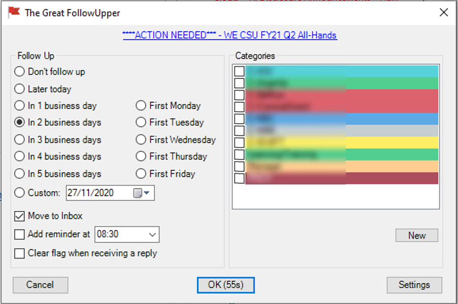
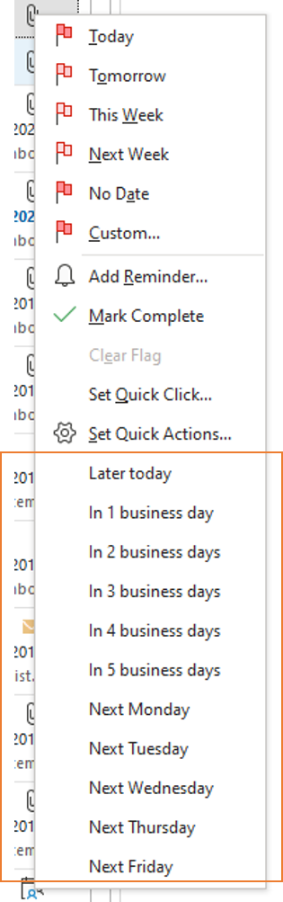
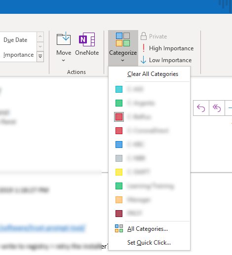
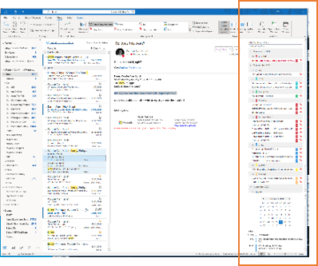
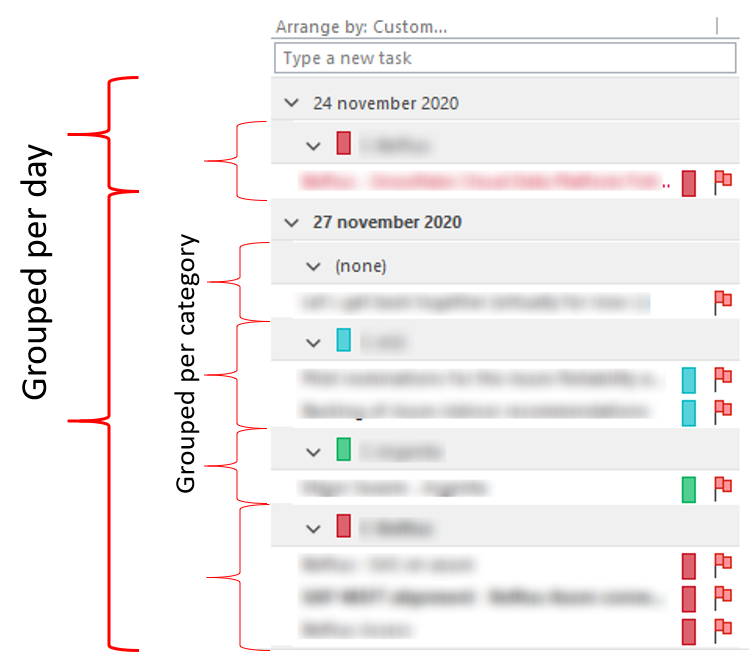
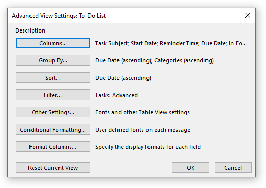
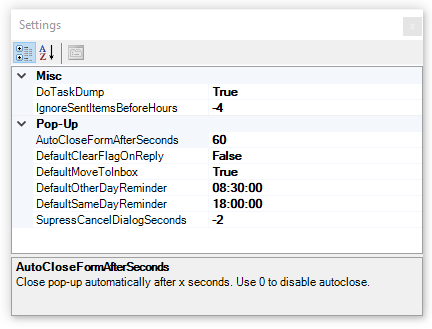

# The Great FollowUpper

- [The Great FollowUpper](#the-great-followupper)
  - [What is The Great FollowUpper?](#what-is-the-great-followupper)
  - [Installation](#installation)
  - [Leveraging Outlook's Native Capabilities](#leveraging-outlooks-native-capabilities)
    - [Categories](#categories)
    - [To-Do Bar](#to-do-bar)
  - [Settings](#settings)
  - [Advanced Features](#advanced-features)

## What is The Great FollowUpper?

The Great FollowUpper is an Outlook plug in that enables you to do great follow up, by leveraging Outlook's native Flagging & Categories.

When you send a mail that will require follow up, the following pop-up is shown, where you can specify when the Flag should be set, an optional reminder and what Category the mail should be set to.

Additionally, it adds extensions to the context menu of an Email, Appointment and RSS Item for shortcuts.

## Installation

Installation can be tricky (as I do not have a trusted certificate to sign the plugin with), especially on enterpise workstations that put restrictions on what end users can do. The following works 'most of the time'.

1. Download the [Trust Prompt Tool](https://www.smartlux.com/software/trust-prompt-tool/), and Enable all prompts (Read from registry > click Enable on all dropdowns > Write to registry). When installing applications from unknown publishers (like me) it will _prompt_ you, instead of flat out refusing to install. Like this:

2. Download the ZIP of the [latest release](https://github.com/woutervanranst/TheGreatFollowUpper/releases/latest), extract the ZIP, double click the setup.exe file.

Alternate options, if you're out of luck:
* https://stackoverflow.com/a/45468516/1582323
* https://stackoverflow.com/a/61909573/1582323 with the certificate found under /code/TheGreatFollowUpper/TheGreatFollowUpper_TemporaryKey.pfx
* https://docs.microsoft.com/en-us/visualstudio/vsto/how-to-configure-inclusion-list-security?view=vs-2019#enable-the-inclusion-list

## Leveraging Outlook's Native Capabilities

### Categories

The Great FollowUpper re-uses the existing Outlook categories.

### To-Do Bar

The To-Do bar sits at the side of the Outlook window, and can list the flagged items.

It can be made to list the flagged items per date and per category:

To configure this:

1. Go to View -> To-Do Bar -> check 'Tasks'
2. Right-click on the To-Do Bar header, click "View Settings"
3. Set "Group By" to "Due Date", then by "Categories"

## Settings

The settings dialog can be accessed through the main window.

| Setting | Description | Why? |
| - | - | - |
| DoTaskDump | Make a dump of all active tasks in the Documents folder each time Outlook starts. | Useful if you accidentally rename a task.
| IgnoreSentItemsBeforeHours | Ignore mails that were sent -x hours ago (eg. from your mobile phone). VALUE MUST BE NEGATIVE. | If you send mails from mobile at night, you don't want 20 pop-ups for all sent items the next day.
| AutoCloseFormAfterSeconds | Close pop-up automatically after x seconds. Use 0 to disable autoclose.
| DefaultClearFlagOnReply | Default value of the 'Clear Flag On Reply' checkbox
| DefaultMoveToInbox | Default value of the 'Move to Inbox' checkbox".
| DefaultOtherDayReminder | Default value for the reminder
| DefaultSameDayReminder | Reminder time for reminders that are to be followed up 'Later today'" | Because you don't want a reminder at 8:30 if it's already noon (Special feature for @PieterH)
| SupressCancelDialogSeconds | Disable the Cancel (close main window) button during the first few seconds | Suppress accidental pressing on of the Cancel button. NEGATIVE VALUE. (Special feature for @NicolasVBD)

## Advanced Features

* Use CTRL+Click on the Context Menu to open the main window